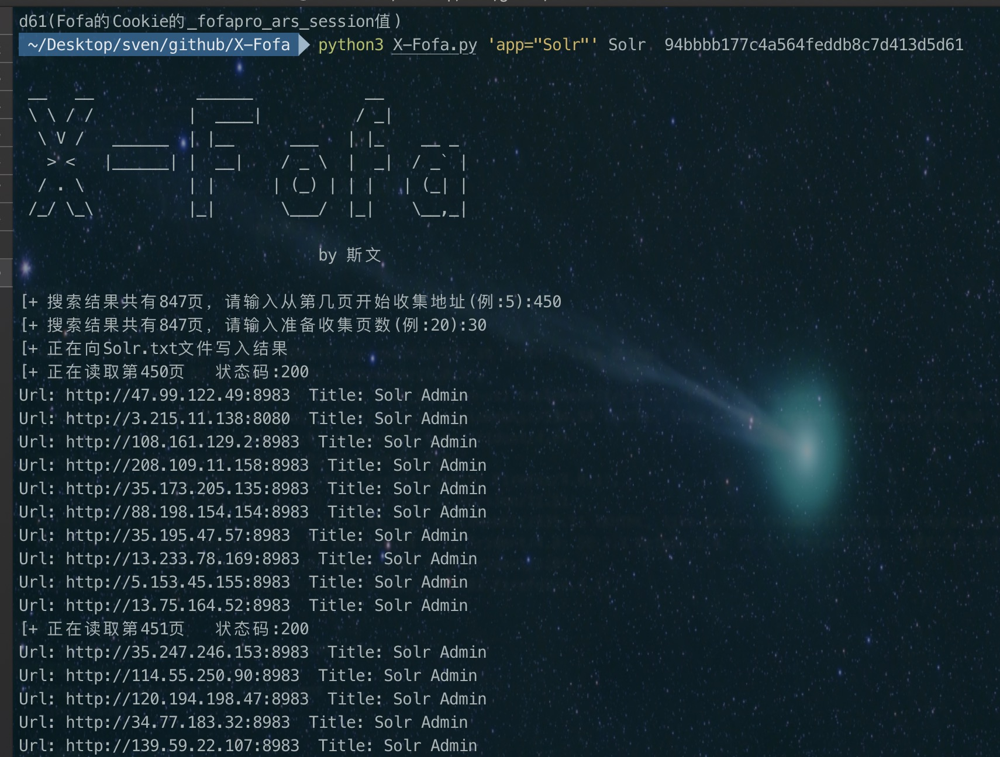
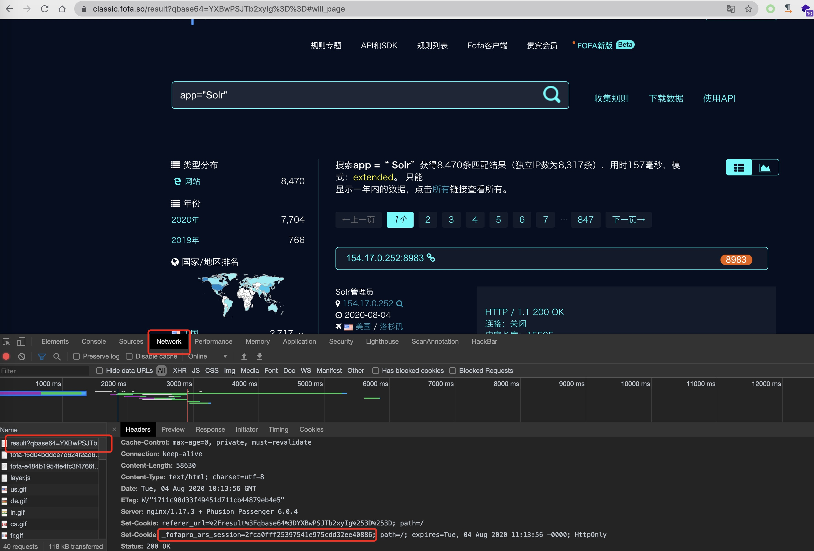

# X-Fofa
基于Fofa会员前提，获得任意页数的目标数量URL

### 用法
* Usage: python3 X-Fofa.py 'app="Solr"' Solr  94bbbb177c4a564feddb8c7d413d5d61
* Usage: python3 X-Fofa.py  Fofa搜索语法   搜索结果文件名   Fofa的Cookie的_fofapro_ars_session值
* 然后按照需求输入 从哪页开始 和 获取多少页数 即可
### 获取_fofapro_ars_session值
* ctrl+C,ctrl+v

PS:为解决部分漏洞在搜索引擎内包含较少，Fofa的API为固定数量获取相同的目标URL，使用API获取会有大量冗余的问题，只需要搜索引擎靠后位置的目标URL，加工自某位师傅(确实是找不到名字了! 0.0)的小工具~
